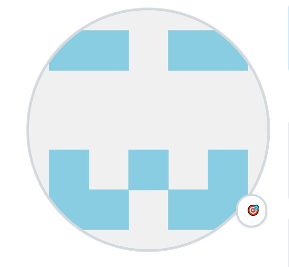
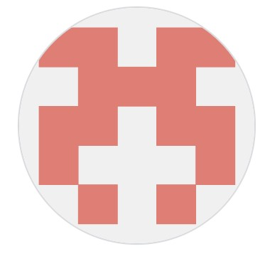

## <충메이트>
**AI를 이용한 기숙사 생활 통합 플랫폼** 입니다. 
&nbsp;

캡스톤디자인 01-11 돔 페리뇽 팀입니다.

&nbsp;

## 🏡 프로젝트 소개
기숙사생의 생활 만족도 향상을 목표로 하는 모바일 어플리케이션입니다.
팀원들의 기숙사 생활 경험에서 발견된 문제점과 룸메이트 간 갈등을 해결하기 위해 기획하였습니다.

&nbsp;
&nbsp;
&nbsp;

## 팀원 소개

<table>
  <tr>
    <td align="center">
      
       <b>팀장(BackEnd) : 이민기</b>
    </td>
    <td align="center">
      
       <b>팀원(AI) : 김아현</b>
    </td>
    <td align="center">
      
       <b>팀원(FrontEnd) : 이서현</b>
    </td>
  </tr>
</table>

&nbsp;
&nbsp;
&nbsp;

## ⚙️ 개발 환경

  
  
  
  
  

&nbsp;

* Flutter 3.29.2
* Android Studio 2024.3.1
* Python
* Firebase
* Github

&nbsp;
&nbsp;
&nbsp;

## 💡 주요 기능
#### 1. AI 룸메이트 추천 기능
   
   * 체크리스트 설문 기반 사용자 특성을 입력받아 개인 데이터 생성
   * **Autoencoder** 모델을 학습해 유사도 기반 임베딩 추출
   * Ranking 알고리즘으로 상위 Top-N 룸메이트 후보 추천
   * 추천 룸메이트 항목별 유사도 확인 가능
   * 1:1 대화 기능 & 필터 검색 기능

&nbsp;

#### 2. AI 챗봇
   * 기숙사 생활 관련 질문에 챗봇이 실시간 응답
   * **Kobert** 기반 문장 분류 모델을 활용해 사용자 질문 의도를 분류

&nbsp;

#### 3. 기숙사 생활 편의 기능
   * NFC 기반 세탁카드 잔액 조회
   * 식단표, 공지사항 조회
   * 자유게시판/공동구매 게시판
   * 기숙사 위치 기반으로 날씨 데이터 제공
   * 환산점수 계산기&실시간 랭킹 조회
